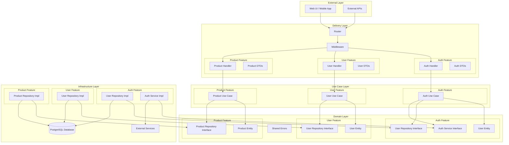
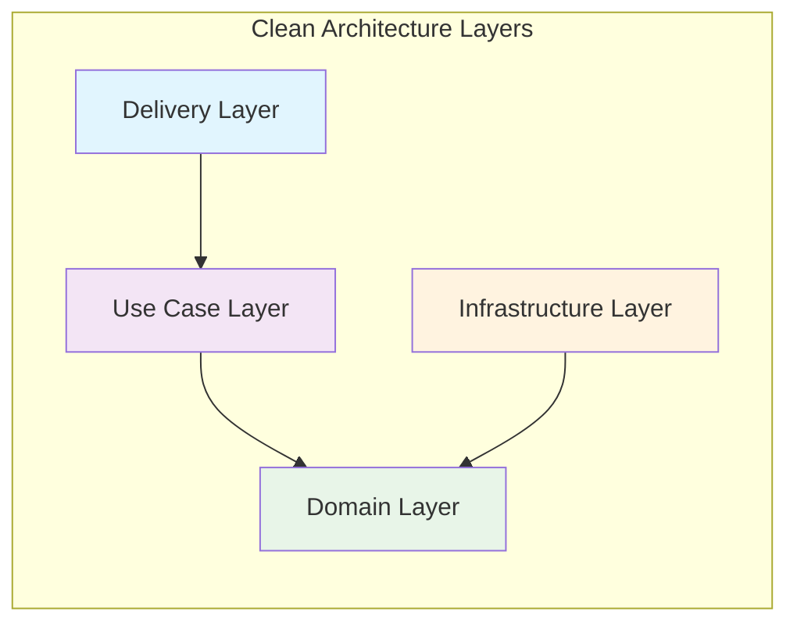
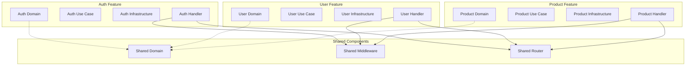
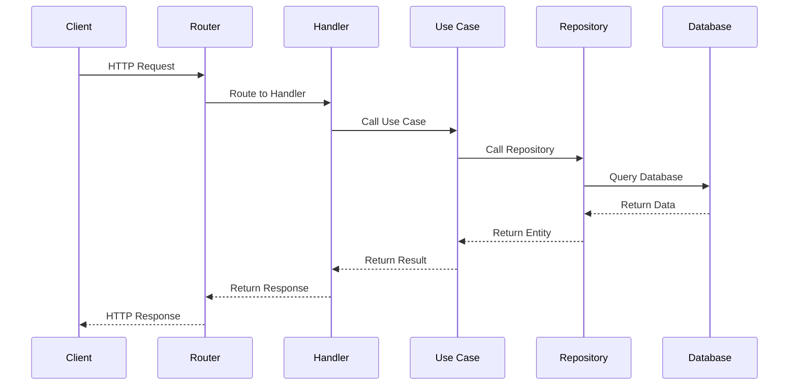
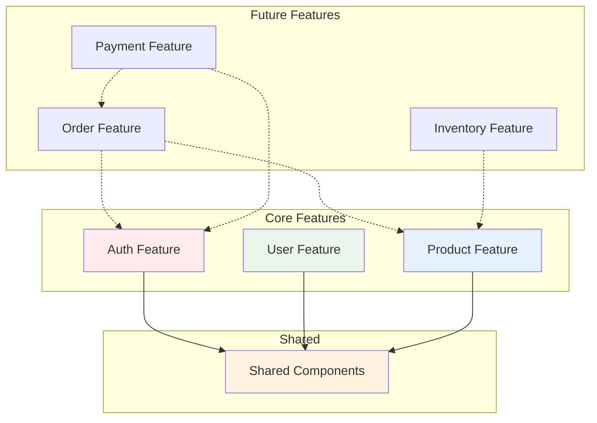
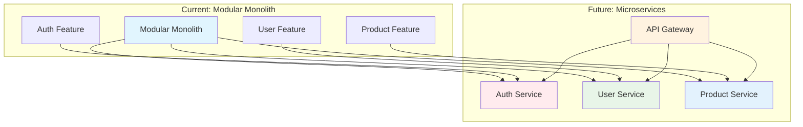

# 🏗️ Architecture Diagram

## Feature-Based Clean Architecture

## Layer Dependencies

## Feature Isolation

## Data Flow

## Feature Dependencies

## Microservices Migration Path

## Key Benefits

1. **🔒 Isolation**: Each feature is self-contained
2. **🔄 Scalability**: Easy to scale individual features
3. **🧪 Testability**: Independent testing per feature
4. **👥 Team Work**: Teams can work on different features
5. **🚀 Migration**: Easy path to microservices
6. **🛠️ Maintenance**: Easier to maintain and debug
